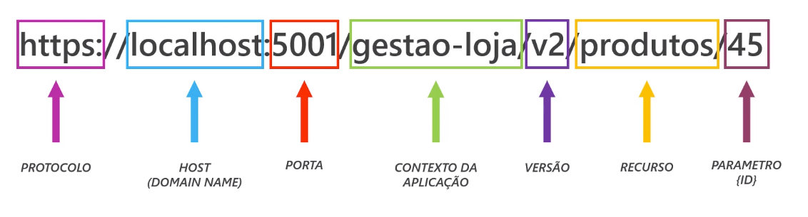

# Fundamentos WebAPIs

## REST
Caracteristicas de uma API RESTful:
 - __*Interface Uniforme*__ - Interfaces consistentes para interagir com recursos promovendo a simplicidade e modularidade. Ex.: Definir endpoints com padrões.
 - __*Client-Server*__ - Separação das camadas permitindo uma evolução independente, ou seja, não entregar a api junto com a aplicação front-end.
 - __*Comunicação Stateless*__ - Requests deve ter todas as informações necessárias para ser processada no servidor.
 - __*Cacheabilidade*__ - Capacidade de armazenar temporariamente dados frequentemente acessados para acelerar a resposta, otimizando o tempo e consumo da base.
 - __*Divisão em camadas*__ - Componentes em um hierarquia em camadas, promovendo a escalabilidade, flexibilidade, etc.
 - __*Versionamento*__ - Prática recomendada que permite que as APIs evoluam sem haver quebra de contrato.

No rest tudo é um recurso, e todo recurso é acessado por uma URI

A boa prática para compor sua URI é manter sempre o nome do recurso a ser acessado e mudar o escopo da requisição com parametros e verbos HTTP.

Ex.: Em vez de usar __"/obter-produtos"__ usar o verbo *GET* em uma rota __"/produtos"__, dessa forma é possivel entender que vamos obter como responsta todos os produtos.

